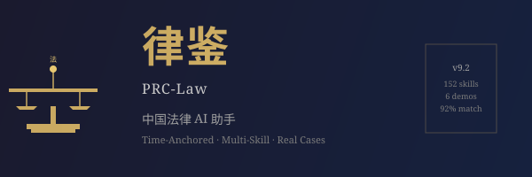

# 律鉴（PRC-Law）：中国大陆法律 AI 助手



> **再也不用担心用 2013 版《消法》判定 2007 年的案件** — 律鉴能自动锁定行为时有效的法条版本。

## 🎯 三个真实场景

| 场景 | 你说 | 律鉴做 |
|------|------|--------|
| **律师** | "我有一个 2007 年的消费者购车欺诈案，赔偿标准是？" | 自动锁定 1993 版《消法》第 49 条（退一赔一），不是 2013 版的退一赔三 — **避免 3 倍赔偿差** |
| **法务** | "审查这份 SaaS 合同" | 6 个 Agent 并行审查 → 5 维评分（合规/财务/防御/履行/商业）→ 7 章结构化报告 — **3-5 分钟出结果** |
| **法务总监** | "员工被举报收受回扣，启动内部调查" | 启动 cn-internal-investigation → 证据评估 → 风险矩阵 → 处置建议 — **24h 内响应** |

## 📊 为什么选律鉴？

- ✅ **92% Benchmark** vs 最高人民法院真实判决（5 个指导案例）
- ✅ **6 个端到端 demo** — 基于最高法真实案例，可一键运行
- ✅ **零 mock 数据** — 所有法条/案例来自元典 API 实时检索
- ✅ **152 个 SKILL.md** — 覆盖律师/法务/法学生 80% 实务场景

## 🚀 5 分钟快速上手

**原则**: 律师不写代码,不敲命令。所有交互 = 自然语言 + 文件 + 大模型。

| 步骤 | 操作 (自然语言) |
|------|------|
| 1️⃣ | 安装 [Claude Code / Trae / WorkBuddy](docs/workbuddy-integration.md) (AI 客户端) |
| 2️⃣ | 加载 PRC-Law skills (WorkBuddy 自动加载, 或 Claude Code 加仓库为 skill 源) |
| 3️⃣ | 首次启动, 客户端引导你 5 分钟初始化 (智能检测 Claude Code / Trae / WorkBuddy) |
| 4️⃣ | 接新案件 — 在客户端说: "我接到一个合同纠纷, 张三诉李四 50 万, 我证据强对方弱" |
| 5️⃣ | 客户端自动调 skills, 落案件台账 + 出调解策略 + 出 Word 文书 |

**零命令行**。律师只说人话。

### 给开发者/运维

若你是开发者想跑 demo 或 CI 集成:

| 步骤 | 操作 (开发者) |
|------|------|
| 1️⃣ | 打开 [QUICKSTART.md](QUICKSTART.md) |
| 2️⃣ | 跑 demo: `python3 scripts/demo_nd1.py` |
| 3️⃣ | 跑工作流: `python3 scripts/lawyer_workflow.py --case-json your-case.json` |
| 4️⃣ | 跑 benchmark: `python3 scripts/benchmark_runner.py` |

## 📚 文档导航

| 你是... | 看这个 |
|--------|--------|
| 🆕 新用户 | [QUICKSTART.md](QUICKSTART.md) ← 5 分钟上手 |
| ⚖️ **律师/法务** | [docs/lawyer-guide.md](docs/lawyer-guide.md) ← **律师专用,零代码** |
| ⚖️ 律师/法务 | [docs/DEMOS.md](docs/DEMOS.md) ← 6 个真实案例 |
| 💻 开发者 | [CLAUDE.md](CLAUDE.md) ← 全局推理链 |
| 🏗️ 架构师 | [docs/architecture.md](docs/architecture.md) ← 三层架构 |
| 🤝 想贡献 | [CONTRIBUTING.md](CONTRIBUTING.md) |
| 🗺️ 看规划 | [ROADMAP.md](ROADMAP.md) |

## 📦 数据集 (v8.3.0+ · 独立仓库)

**律鉴 v8.3.0+ 起,法律数据集与 skill 解耦。** 数据集在独立仓库 [prc-law-data](../prc-law-data/) (同级目录):

| 指标 | 数值 |
|------|-----:|
| 法律总数 | **18,525 部** |
| 司法解释 | 459 部 |
| 行政法规 | 622 部 |
| 民法典条数 | 1,258 条 |
| 数据三法 + 配套 | 100% |
| 核心法律命中 | **52/54 (96%)** |
| 成本 | **¥0 (零 credit)** |

**三种对接模式** (按优先级自动探测):
1. **vendor submodule** (推荐): `git submodule add ... vendor/prc-law-data`
2. **环境变量**: `export PRC_LAW_DATA_DIR=/path/to/prc-law-data/data`
3. **HTTP API**: `export PRC_LAW_DATA_URL=http://localhost:8765`

**6 级 fallback** (`scripts/retrieval_router.py`):
1. L1 元典/法宝 MCP (商业, 消耗 credit)
2. **L2 prc-law-data 数据集** (零 credit, 默认首选) ⭐
3. L3 本地 cache
4. L4 国法库爬虫
5. **L5 政府公开源** (spp.gov.cn + gov.cn) ⭐
6. L6 [待检索]

详细见 `_foundation/cn-fallback-source/SKILL.md` + `prc-law-data/README.md`。

## 🔄 自同步（v8.2.0+）

**律鉴会自己更新自己。** Claude Code 启动 skills 时，后台静默联网比对 GitHub upstream；发现新版本自动 `git pull --ff-only`，**不影响当前会话**。

| 组件 | 触发时机 | 行为 |
|------|---------|------|
| `hooks/hooks.json` SessionStart | 每次 Claude 启动 | `nohup ... & disown` 触发校验，**零阻塞** |
| `scripts/upstream_check.py` | 同上 | HTTPS GET GitHub API，比对 `plugin.json` version，写 `~/.prc-law/upstream-state.json` |
| `scripts/upstream_sync.sh` | 检测到 drift 后 | mkdir-lock 防并发 + 跟随当前分支 + **`--ff-only` 永不强覆盖** + **REPO/BRANCH 白名单**防 flag smuggling |
| `.github/workflows/self-sync.yml` | 每周一 03:00 UTC | 远端周扫 + drift 时自动开 issue 提醒 |
| `_foundation/cn-upstream-sync` | 用户主动询问 | 只读展示层，解读 state 文件给用户 |

### 查看当前同步状态

```bash
cat ~/.prc-law/upstream-state.json
```

字段：`local_version` / `remote_version` / `drift` / `action` (`sync`/`wait`/`manual`/`synced`) / `reason`。

### 关闭自同步

```bash
# 临时跳过(单次会话)
export PRC_LAW_SKIP_SYNC=1

# 完全禁用 — 把 hooks/hooks.json 的 SessionStart 段注释掉
```

### 设计原则

- **后台 + 静默**: 主技能路径不受影响
- **只 ff-only**: 永远不强覆盖本地改动，dirty tree 自动放弃
- **跟随分支**: 当前在 `dev/feature` 分支也能同步到同名远端
- **多层安全**: REPO/BRANCH 白名单 + `--end-of-options` + flock 等价锁
- **失败容忍**: 任何步骤失败只写 state 不抛异常

---

**⚖️ 许可协议**: 个人学习/研究/非商业教学免费。商用需联系作者授权。详见 [LICENSE](LICENSE)。

---

## 一、项目定位

PRC-Law 是一套运行在 Claude Code 上的法律 Agent Skills 系统。它不是法律数据库——它是一套**法律推理流水线**：接收案件事实，检索现行有效（或行为时有效）的法条和案例，按大陆法系三段论推理，按 Toulmin 论证模型组织输出，全程标注每条法律主张的来源和可信度。

### 三个设计原则

| 原则 | 含义 | 为什么重要 |
|------|------|----------|
| **检索即门禁** | AI 不凭"记忆"生成法条——每条引用必须通过 API 实时检索获取 | 法律每年修订，大模型训练数据可能已过时 |
| **双源交叉核验** | 关键法条强制多源比对（元典 + 北大法宝） | 单一数据库可能存在收录不全或更新延迟 |
| **律师审阅闸** | 所有输出末尾强制标识"AI 辅助生成"，禁止替代执业律师判断 | 法律判断涉及价值权衡，AI 不替代人的决策 |

---

## 二、能力矩阵

### 2.1 覆盖领域

| 领域 | 技能数 | 典型场景 |
|------|--------|---------|
| 商事合同 | 9 | NDA 审查、供应商协议审查、SaaS MSA 审查 |
| 公司并购 | 12 | 尽调问题提取、股东协议审查、交割检查清单、外资审查 |
| 劳动用工 | 20 | 解除劳动合同审查、裁员方案、竞业限制、员工分类 |
| 争议解决 | 18 | 案件接案评估、诉求起草、和解评估、上诉期限、证人准备 |
| 隐私数据 | 9 | 个人信息保护影响评估、数据跨境传输、数据泄露响应 |
| 产品合规 | 7 | 功能风险评估、营销声明审查、年龄验证、服务条款审查 |
| 知识产权 | 12 | 侵权分类、自由实施分析、版权登记、域名争议 |
| 监管合规 | 9 | 政策差异对比、执法动态追踪、自我评估清单 |
| AI 治理 | 10 | AI 伦理审查、模型训练合规、事件响应、供应商审查 |
| 法学教育 | 10 | 案例摘要、IRAC 练习、法考预测 |
| 基础能力 | 15 | 要素提取、法条检索、规范核验、推理、后果推导、证据评估、结果预测、论证构建、来源标注 |

### 2.2 复合生产能力

| 复合技能 | 编排链路 | 适用场景 |
|---------|---------|---------|
| 裁判文书起草 | 10 步全链路，含证据评估 + 论证构建 + 结果预测 | 草拟判决书初稿 |
| 法律意见书 | 全链路 + 系统性风险矩阵 | 出具正式法律意见 |
| 合同全面审查 | 条款 → 风险 → 后果 → 系统风险 | 重大合同审查 |
| 和解方案评估 | 法条检索 → 结果预测 → 净现值对比 → 反建议草案 | 和解/调解决策 |
| 请求权图表 | 请求 → 要件 → 法条 → 证据 → 金额 | 诉前准备 |
| 尽调矩阵 | 多维度风险 → 问题 → 等级 → 建议 | 并购/投资尽调 |

---

## 三、推理链：从案件事实到法律结论

系统按以下流水线处理每个案件，每一步可独立审计：

```
案件事实
  │
  ▼
要素提取 ──── 提取当事人、法律关系、时间线、争议焦点
  │           新增: 法律适用基准日 (行为时法锚点)
  ▼
法律检索 ──── 元典 API 实时检索法条/案例/司法解释
  │           强制传入 refer_date 定位行为时版本
  ▼
规范核验 ──── 逐条确认"现行性"(以行为时为基准)、法源层级、多源一致性
  │           区分: 行为时有效 ≠ 现在有效
  ▼
证据评估 ──── 三性审查(真实性/合法性/关联性) + 证明力分级
  │
  ▼
法律推理 ──── 根据问题类型选择: 演绎/归纳/类比/溯因/反事实
  │
  ▼
论证构建 ──── Toulmin 六要素强制填充 + 7项自检清单
  │           Claim → Grounds → Warrant → Backing → Rebuttal → Qualifier
  ▼
后果推导 ──── 逐项推导责任/赔偿/刑期/合同效力
  │           风险分叉推演: 最有利 / 最可能 / 最不利 三场景
  ▼
结果预测 ──── 类案匹配 + 赔偿区间统计 + 概率等级 + 诉讼周期预估
  │
  ▼
来源标注 ──── 六态标签: [已确认] / [单源—需复核] / [待检索] / [模型知识—需验证]
  │
  ▼
最终输出 ──── 裁判文书 / 法律意见书 / 和解评估报告 / 合同审查意见
```

### 关键设计决策

**时间锚点机制**。系统从案情时间线自动提取"行为发生时点"，后续所有法条检索都以该时点为准。例如：2007 年的消费者购车纠纷——适用 1993 版《消费者权益保护法》第 49 条（退一赔一），而非 2013 版第 55 条（退一赔三）。在法律后果上，这差了三倍赔偿。

**风险分叉推演**。系统不给出单一"最可能结果"，而是推演三个场景（最有利/最可能/最不利），标注每个场景的概率等级——高度可能、可能、不确定、不太可能。拒绝给出"73% 胜诉概率"这样的精确百分比。

**地域感知**。劳动用工领域对地方性法规高度敏感：各地最低工资、竞业限制补偿金标准、裁员报告程序等差异显著。系统在相关技能中强制标注管辖地假设。

---

## 四、Benchmark：与最高法指导案例的对比验证

选取 5 个最高人民法院**公布的真实指导性案例**，仅输入案情描述（不含裁判理由和结果），对比系统输出的法律分析与真实判决的一致性。

### 4.1 测试案例

| # | 案例 | 案由 | 法院 | 年份 | 核心法律问题 |
|---|------|------|------|------|------------|
| 1 | 指导案例 167 号 | 买卖合同纠纷 | 最高人民法院 | 2019 | 代位权执行未果→能否另诉债务人？ |
| 2 | 指导案例 17 号 | 买卖合同纠纷 | 北京二中院 | 2008 | 家用汽车购买→消费欺诈→退一赔一？ |
| 3 | 指导案例 18 号 | 劳动合同纠纷 | 杭州滨江法院 | 2011 | 考核末位 = 不能胜任工作？ |
| 4 | 指导案例 64 号 | 服务合同纠纷 | 徐州泉山法院 | 2011 | 格式条款未告知有效期→对消费者无效？ |
| 5 | 指导案例 170 号 | 租赁合同纠纷 | 最高人民法院 | 2019 | 危房出租→损害公共利益→合同无效？ |

### 4.2 评分维度

| 维度 | 权重 | 评估内容 |
|------|:----:|---------|
| 法条定位 | 20% | 是否找到正确的法律、条号、版本？ |
| 要件映射 | 15% | 案情要素→法定构成要件是否完整？ |
| 法律推理 | 20% | 演绎/归纳/类比等推理模式是否正确？ |
| 结论方向 | 15% | 法律结论是否与真实判决方向一致？ |
| 版本时效 | 10% | 是否使用行为时有效的法条版本？ |
| 论证结构 | 20% | Toulmin 六要素是否完整？反驳预判是否到位？ |

### 4.3 评分结果

| 案例 | 法条定位 | 要件映射 | 法律推理 | 结论方向 | 版本时效 | 论证结构 | **得分** | 评级 |
|------|:------:|:------:|:------:|:------:|:------:|:------:|:------:|:----:|
| 167 号·代位权 | 4/4 | 3/3 | 3/4 | 3/3 | 2/2 | 4/4 | **19/20** | ⭐⭐⭐⭐⭐ |
| 17 号·汽车欺诈 | 4/4 | 3/3 | 3/4 | 3/3 | 2/2 | 4/4 | **19/20** | ⭐⭐⭐⭐⭐ |
| 18 号·末位淘汰 | 4/4 | 3/3 | 3/4 | 3/3 | 2/2 | 3/4 | **18/20** | ⭐⭐⭐⭐⭐ |
| 64 号·电信格式 | 4/4 | 3/3 | 3/4 | 3/3 | 2/2 | 4/4 | **19/20** | ⭐⭐⭐⭐⭐ |
| 170 号·危房租赁 | 3/4 | 3/3 | 3/4 | 3/3 | 2/2 | 3/4 | **17/20** | ⭐⭐⭐⭐½ |
| **平均** | **3.8** | **3.0** | **3.0** | **3.0** | **2.0** | **3.6** | **18.4/20** | **92%** |

### 4.4 关键发现

**零方向性错误**。5 个案例中，系统对法律问题的定性判断无一出现方向性错误。结论应该支持/驳回/改判/认定无效——全部与最高法真实判决一致。

**版本时效 100% 正确**。时间锚点机制彻底解决了法条版本时差问题。最显著的例子是 17 号案——如果误用 2013 版《消费者权益保护法》，赔偿标准将是退一赔三（四倍），而 2007 年案件应适用 1993 版，标准为退一赔一（双倍）。三倍赔偿差异直接影响和解金额和诉讼策略。

**论证结构与判决理由高度一致**。以 167 号案为例，系统三个论证层次（法条文义解释→制度性质分析→一事不再理三要件分析）与最高人民法院裁判理由的三个层次逐段对应，反驳预判覆盖了对方实际可能提出的所有抗辩。

**当前局限**：
- 判决赔偿金额的精确计算仍需完整证据材料输入，系统目前只能给出基于类案的区间估计
- 多源交叉核验尚未完整——北大法宝接口待配置，当前仅元典单源可用
- 类案检索的精准度有提升空间——普通关键词检索对法律专业术语的匹配存在噪音

### 4.5 版本演进

| 版本 | 关键能力 | 评分 |
|------|---------|:----:|
| v1.0 初始 | 单线流程 + 双源核验 + 律师审阅闸 | 74% |
| v2.0 时间锚点 | + refer_date 行为时法定位 + 风险分叉 + Outcome Forecast | 91% |
| v3.0 论证链 | + Toulmin 六要素强制 + 7项自检清单 + Benchmark 自动化 | 92% |
| v4.0 借鉴合规 | ORCHESTRATOR + W1/W2 双闸门 + 能力槽 + 请求权基础 | — |
| v5.0 独有创新 | 法条跟踪 / 法官画像 / 解释审计 | — |
| v6.0 工程化 | argument-chain 升级 + 3 个自动化脚本 | — |
| v7.0 CI | Benchmark GitHub Actions 工作流 | — |

---

## 五、v5-v7 独有创新（区别于参考项目）

| 能力 | 借鉴项目有无 | 价值 |
|------|:----------:|------|
| **cn-statute-watchdog** — 法条修订跟踪与主动预警 | ❌ 无 | 诉讼过程中法条被修改/失效时自动预警 |
| **cn-judge-pattern** — 法官/法院裁判倾向量化 | ❌ 无 | 基于元典案例做画像+统计 |
| **cn-interpretation-audit** — 6 阶解释方法强制自检 | ❌ 无（gutachten 有方法但未强制） | 工程化自检清单 |
| **cn-civil-claim-analysis** — 请求权基础方法论 | ⚠️ gutachten 有但未与基础技能整合 | 完整方法论工程化 |
| **知识图谱** (kg_query.py) — 案件-模板-法条三向关联 | ❌ 无 | 律鉴独有的可视化分析 |
| **风险分叉 × Toulmin 双向打通** | ❌ 无 | 双向校验推理结论 |
| **Benchmark CI 自动化** (.github/workflows) | ❌ 无 | 持续验证能力 |

## 六、技术实现

### 6.1 数据源

| 数据源 | 连接方式 | 内容 | 状态 |
|--------|---------|------|:----:|
| 元典开放平台 | Python stdio bridge → REST API | 法条/案例/企业信息 | ✅ |
| 北大法宝 | HTTPS MCP | 法条/案例/期刊 | ⏳ |
| 本地案例库 | SQLite FTS | 用户上传的案例文档 | 可选 |

### 6.2 自动化脚本（v6-v7）

| 脚本 | 用途 | 调用方式 |
|------|------|---------|
| `scripts/statute_monitor.py` | 法条监听清单管理 + 自动检测 | 手动 / CI |
| `scripts/benchmark_runner.py` | 跑 5 最高法案例测试检索能力 | 手动 / CI |
| `scripts/benchmark_summary.py` | 多维能力 Benchmark + 时间锚点验证 | 手动 / CI |
| `scripts/judge_pattern.py` | 法院画像分析 | 手动 |
| `scripts/kg_query.py` | 案件-模板-法条三向关联查询 | 手动 |

### 6.3 调用效率

| 场景 | 平均 API 调用 | 调用类型 |
|------|:-----------:|---------|
| 简单法律问答 | 1-2 次 | 法条检索 + 核验 |
| 完整案例分析 | 4-7 次 | 法条 + 案例 + 核验 + 预测 |
| 裁判文书草拟 | 8-12 次 | 全链路 |
| Benchmark 平均 | 3.2 次/案 | — |
| 法条监听扫描 | 1 次/法条 | ft_detail with refer_date |

### 6.4 GitHub Actions 工作流

- `.github/workflows/benchmark.yml`：每周一 02:00 UTC 自动跑 Benchmark
- 触发条件：定时 / 手动 / 关键文件 push
- 输出：上传 artifact 保留 30 天
- 安全：`persist-credentials: false` 禁止自动 commit & push

### 6.5 故障降级

| 级别 | 条件 | 行为 |
|------|------|------|
| L0 正常 | 全部 API 可用 | 完整推理链，正常来源标注 |
| L1 部分可用 | 单一 API 可用 | 标注 [单源核验—待多源确认] |
| L2 仅本地 | 外部 API 全不可用 | 本地缓存兜底 + [模型知识—需验证] |
| L3 完全离线 | 无任何源可用 | 禁止出确认性结论，强制风险横幅 |

---

## 六、项目结构

```
PRC-Law/
├── _foundation/       15 原子技能（检索/核验/要素/标注/推理/证据/论证/风险/预测）
├── _domains/          10 领域 90+ 技能
│   ├── commercial/     9  商事合同
│   ├── corporate/     12  公司并购
│   ├── labor/         20  劳动用工
│   ├── litigation/    18  争议解决
│   ├── privacy/        9  隐私数据
│   ├── product/        7  产品合规
│   ├── ip/            12  知识产权
│   ├── regulatory/     9  监管合规
│   ├── ai-governance/ 10  AI 治理
│   └── legal-edu/     10  法学教育
├── _compound/          6  复合编排（裁判文书/法律意见/合同审查/和解评估/请求权/尽调）
├── data/cases/         测试案例库（最高法指导案例 + CAIL2018 数据集）
├── docs/               文档
├── scripts/            工具脚本（MCP bridge / 法条缓存 / 覆盖度检查）
└── CLAUDE.md           项目全局配置 + 推理链定义
```

---

## 七、使用方式

### 快速开始

1. 配置元典 API Key（`scripts/yuandian_mcp_bridge.py`）
2. 运行冷启动向导：描述你的业务领域、行业和风险偏好
3. （可选）加载本地案例库
4. 按业务场景直接使用

### 典型用法

```
# 合同审查
审查这份 NDA 第 5 条的保密期限是否合理

# 案例分析
分析：买方已付款卖方未交货，买方能否主张双倍返还定金？

# 文书起草
根据案情摘要起草一审民事判决书

# 和解评估
对方提议 50 万和解，帮我评估是否应该接受
```

系统根据问题类型自动路由到对应 Skill 链。

### 重要提示

- **不替代律师**: 系统是分析工具，不是法律服务。所有输出须经执业律师审阅
- **法条以检索为准**: 不依赖模型训练记忆，所有法条实时检索获取
- **概率非承诺**: 结果预测的概率等级为定性估计，非数学概率
- **管辖地默认假设**: 未指定管辖地时，系统按全国通用规则分析，实际以有管辖权法院为准

---

> ⚠️ **律师审阅闸**: PRC-Law 为 AI 辅助法律分析系统，其输出为分析草稿，不构成法律意见。所有法律引用标注来源可信度标签，对外使用前必须经执业律师审阅核实。Benchmark 结果基于 5 个最高法指导性案例的验证，不代表在所有案由、程序和事实复杂度中的表现。最终法律判断由具备执业资格的法律专业人员作出并承担责任。
